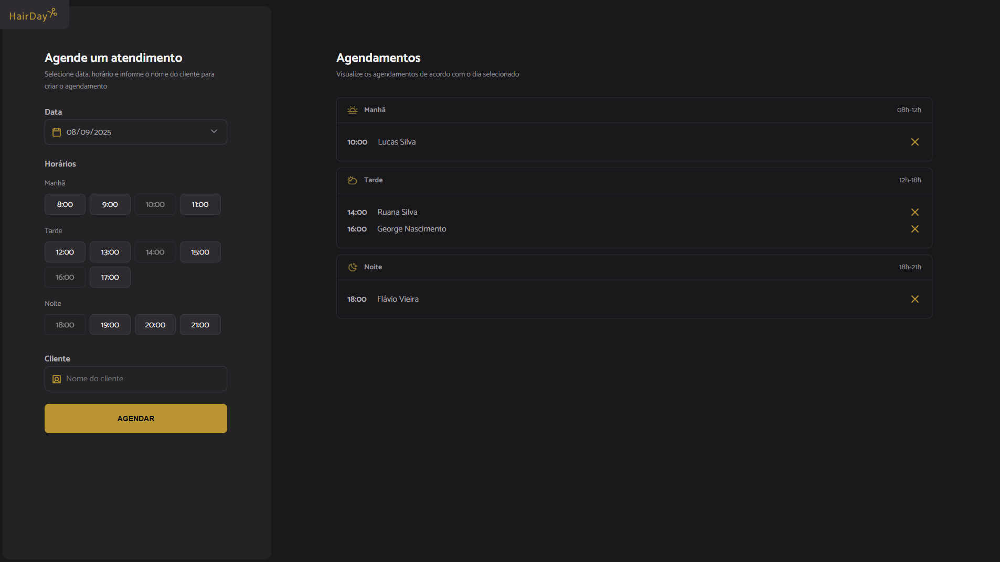

# :haircut: Hair Day - Aplicação WEB para agendamentos de cortes de cabelo

## :hammer_and_wrench: Tecnologias utilizadas


Nesta aplicação, é possível selecionar datas e horários para agendar clientes em uma **API fake** criada com **JSON Server**, além de remover esses cadastros.
Os horários funcionam dinâmicamente, ou seja, ficam indisponíveis se já passados ou agendados por alguém.

## :camera: Foto do projeto



## :bulb: Como testar o projeto

**1. Ter o Git instalado em sua máquina;**
**2. Clonar o repositório usando um terminal;**

```bash
git clone https://github.com/llucasgs/hairday-project.git
```

Isso vai criar uma pasta com o nome do repositório. Então, abra a pasta dentro do editor de código **VS Code.**

**3. Instale as dependências do projeto;**

```bash
npm install
```

**4. Use os comandos abaixo para:**
4.1. Rodar a API json server

```bash
npm run server
```

4.2. Rodar o servidor local (Webpack Dev Server) e testar a aplicação

```bash
npm run dev
```
